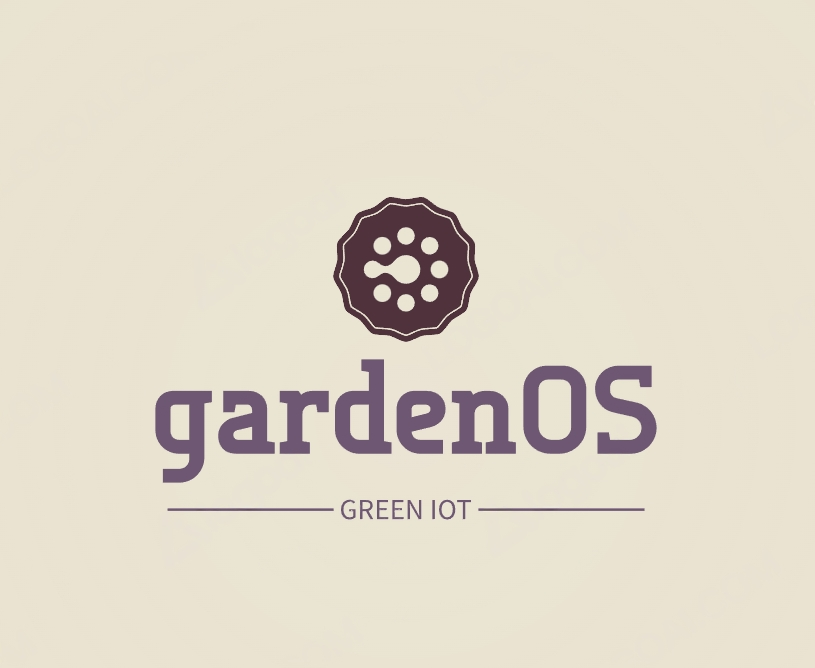

# 

    A small IoT project to make even a remote garden as smart as possible

New device template
INSERT INTO devices (device_id, device_name, device_typ, address)
VALUES (gen_random_uuid(), '', '', '');